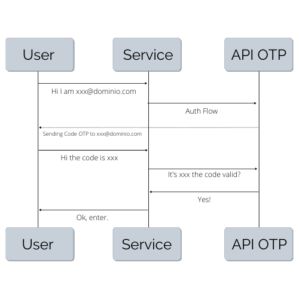
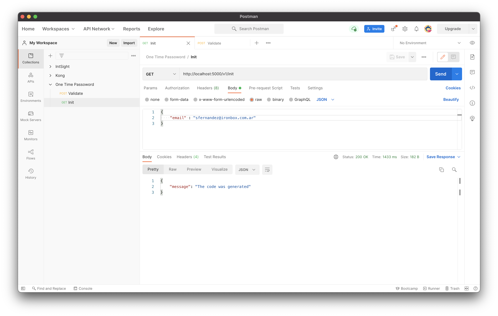
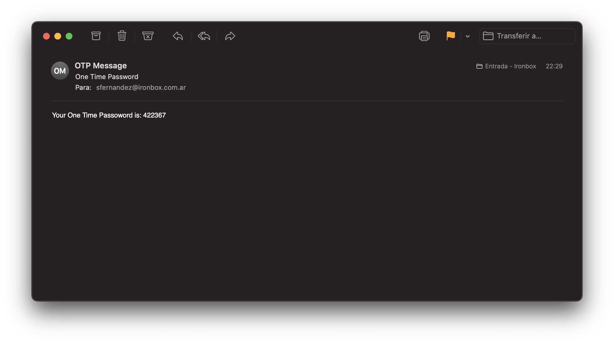
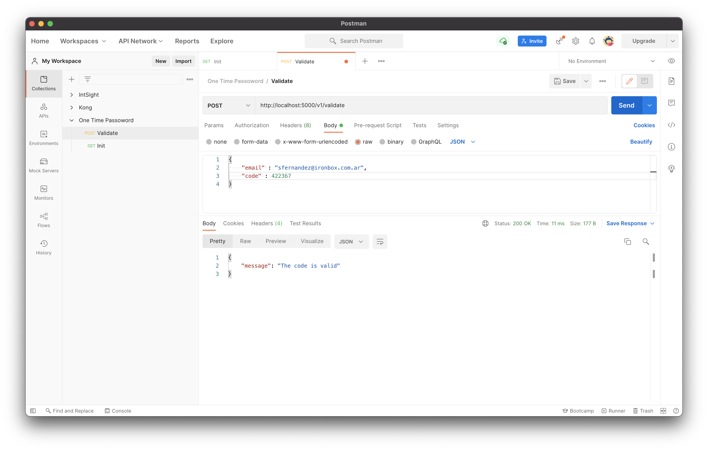

# One Time Password API

## Create the database

On database folder run the following command.

```
sqlite3 users.db < init.sql
```
## Request

1. http://localhost:5000/v1/init [GET]
2. http://localhost:5000/v1/validate [POST]

## API OTP Flow

<p align="center">

</p>

## Steps

Check with the user's email.

curl -X GET http://localhost:5000/v1/init \
    -H 'Content-Type: application/json' \
    -H 'x-api-key: api_key' \
    -d '{"email":"mail@tudominio.com"}'

<p align="center">

</p>

If the user is in the database, an email will be sent with the OTP code.

<p align="center">

</p>

The user must perform the POST with their email and code. The time that the code is alive depends on the variable ***timeToLease***

curl -X POST http://localhost:5000/v1/validate \
-H 'Content-Type: application/json' \
-H 'x-api-key: api_key' \
-d '{"email":"mail@tudominio.com", "code":509877}'

<p align="center">

</p>

## Create & Run the Docker Container

Create the image with this command

```
docker build -t onetimepass:latest .
```
To run the API Microservice

```
docker run -p 5000:5000 \
-e STMP_SERVER="smtp.xxxcom.ar" \
-e EMAIL_USER="mail@tudominio.com" \
-e EMAIL_PASSWORD="pass" \
-e API_KEY="key" \
onetimepass:latest
```

## To Do

✔️ Add SSL
✔️ Add JWT
✔️ Active Directory Integration