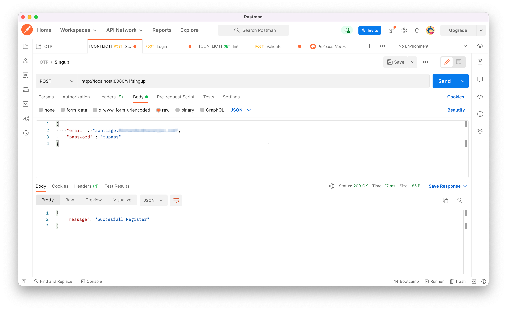
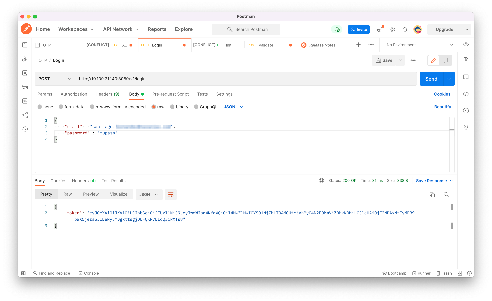
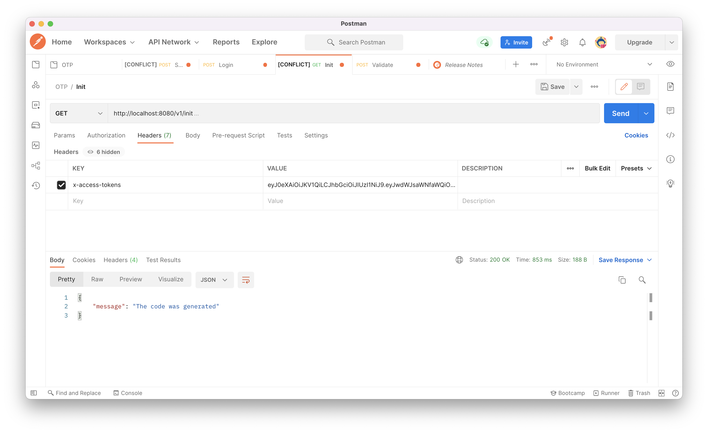
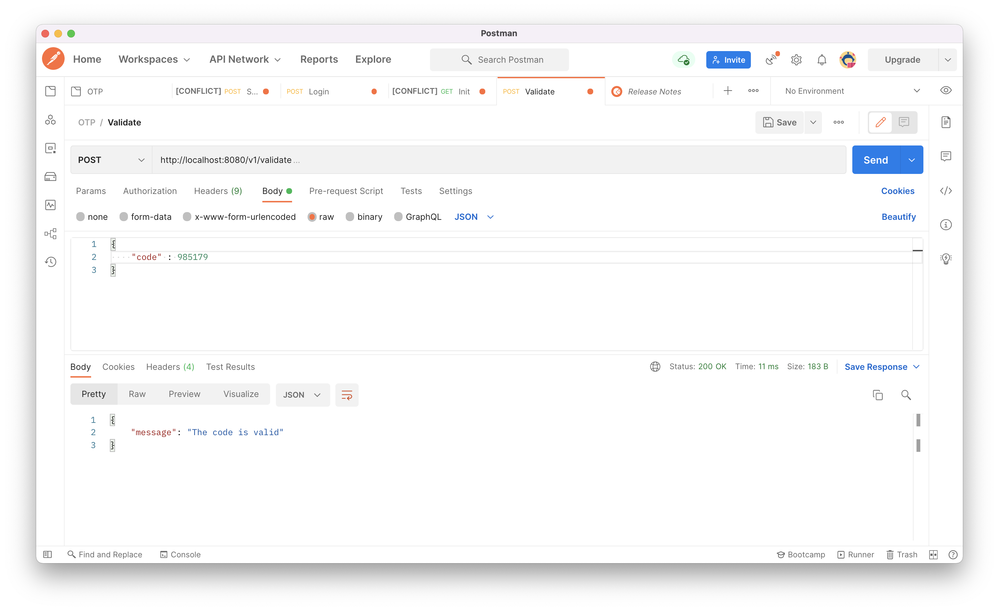

# One Time Password API

[[Watch the video]](https://youtu.be/Y6y00CdzcHE?t=35s)

## Create the database

On database folder run the following command.

```
sqlite3 users.db < init.sql
```
## Request
1. http://localhost:5000/v1/singup [POST]
2. http://localhost:5000/v1/login [POST]
3. http://localhost:5000/v1/init [GET]
4. http://localhost:5000/v1/validate [POST]

## API OTP Flow

<p align="center">

</p>

## Steps

Singup the user.
```
curl -X POST http://localhost:8080/v1/singup \
    -H 'Content-Type: application/json' \
    -H 'x-api-key: tuapikey' \
    -d '{"email":"mail@tudominio.com", "password":"tupass"}'
```

<p align="center">

</p>

Login
```
curl -X POST http://localhost:8080/v1/login \
    -H 'Content-Type: application/json' \
    -H 'x-api-key: tuapikey' \
    -d '{"email":"mail@tudominio.com", "password":"tupass"}'
```
<p align="center">

</p>

Star the flow.
```
curl -X GET http://localhost:8080/v1/init \
    -H 'Content-Type: application/json' \
    -H 'x-access-tokens: tutoken'

```

<p align="center">

</p>

The Email. If the user is in the database, an email will be sent with the OTP code.

<p align="center">

</p>

Validate the Code.
```
curl -X POST http://localhost:8080/v1/validate \
    -H 'Content-Type: application/json' \
    -H 'x-api-key: tutoken' \
    -d '{"code":"tucode"}'
```

<p align="center">

</p>

The user must perform the POST with their code. The time that the code is alive depends on the variable ***timeToLease*** on the token constractor

## Create & Run the Docker Container

Create the image with this command

```
docker build -t onetimepass:latest .
```
To run the API Microservice

```
docker run -p 5000:5000 \
-e STMP_SERVER="smtp.xxxcom.ar" \
-e EMAIL_USER="mail@tudominio.com" \
-e EMAIL_PASSWORD="pass" \
-e API_KEY="key" \
-e SECRET_KEY="key"
onetimepass:latest
```

## To Do

✔️ Add SSL
✔️ Active Directory Integration o CIAM